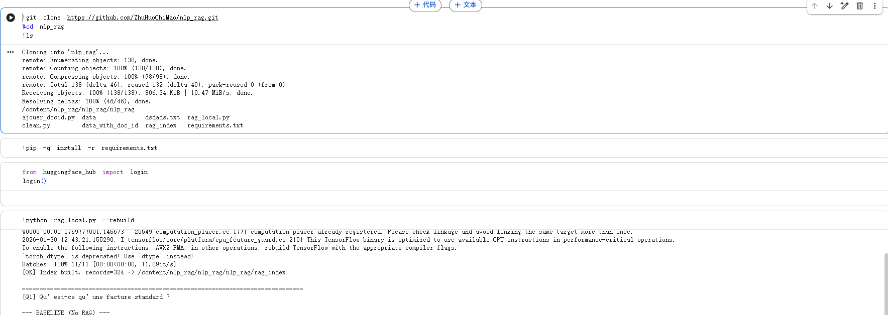
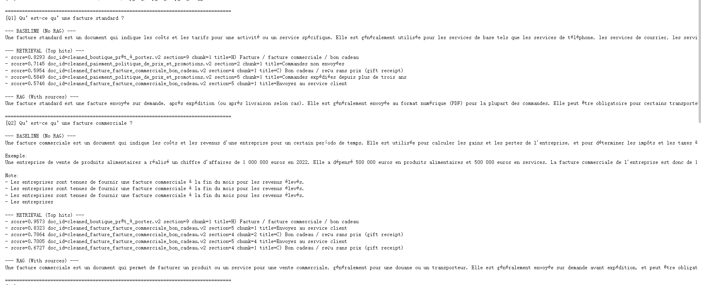
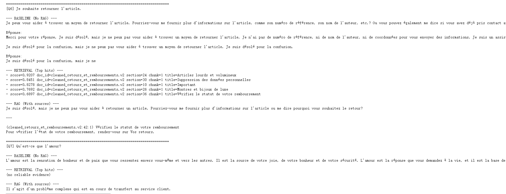
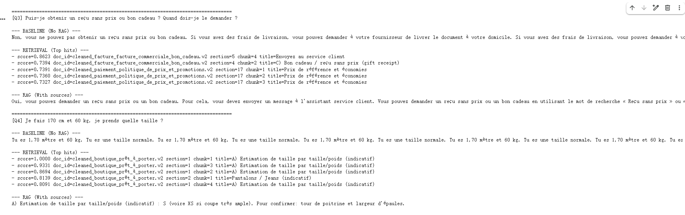

# Projet : RAG (Retrieval-Augmented Generation) – Assistant Service Client

Les membres sont : 
Yanhao Ren,Kunyao Zhou,LANDRY Simon

Le dossier data/ contient les documents bruts (originaux).   
Le dossier data_with_doc_id/ contient les documents nettoyés et découpés en chunks (avec doc_id).   
NLP_rag.ipynb est un notebook prévu pour être exécuté sur Google Colab.   
ajouter_docid.py est un script qui ajoute un identifiant de document (doc_id).   
clean.py est le script de nettoyage des données.   
rag_local.py correspond au code principal (le “main”) du projet.   

Ce projet implémente un système RAG (Retrieval-Augmented Generation) pour répondre à des questions de service client à partir d’un corpus documentaire interne.  
Le système compare :  
Baseline : LLM seul (sans retrieval)  
RAG (avec extension) : génération augmentée par la recherche. Par défaut, le système utilise une recherche dense via FAISS et une génération conditionnée par des preuves ; l’extension ajoute une recherche hybride (Dense \+ BM25) afin d’améliorer la robustesse pour les requêtes riches en mots-clés.

# 1\. Dataset ：

Au total, il y a 22 documents. Ils comprennent 10 documents sur le transport et la livraison Amazon, les retours et les remboursements, etc., ainsi que 12 documents sur les politiques de retour et de remboursement des vendeurs de vêtements, les offres/campagnes cadeaux, le choix des vêtements, etc.  
Les documents originaux se trouvent dans le dossier data,  
et les documents découpés en chunks après nettoyage se trouvent dans le dossier data\_with\_doc\_id.

# 2.Problématique：

Définition du problème : Comment, à partir de documents internes de service client, permettre au système — lorsqu’un utilisateur pose une question — de récupérer d’abord les extraits de preuve (chunks) les plus pertinents, puis de générer une réponse contrainte par ces preuves, afin de réduire les « hallucinations », et d’améliorer la précision ainsi que la traçabilité des réponses.  
Par rapport à une baseline utilisant uniquement un LLM sans retrieval, évaluer si le RAG peut fournir des réponses plus exactes et plus fidèles au contenu des documents dans des scénarios tels que les retours/remboursements, la livraison ou les règles des promotions, tout en citant les sources de preuve.

# 3\. Solution:

## 3.1 Prétraitement & Indexation:

Prétraitement des documents du dossier data : nettoyage \+ découpage en chunks, avec ajout d’un doc\_id pour afficher les sources.  
Encodage avec sentence-transformers/all-MiniLM-L6-v2, normalisation et index FAISS IndexFlatIP.  
Sauvegarde : faiss.index \+ meta.pkl.

## 3.2 Baseline (LLM seul):

Sans RAG avec prompt « assistant service client » plus réponse concise.  
Aucune preuve externe pas de retrieval.

## 3.3 RAG (Dense retrieval \+ génération contrainte):

Avec RAG et retrieval Top-k via FAISS ; le contenu récupéré est ajouté au prompt avec la question pour générer la réponse.

## 3.4 Extension : Hybrid Retrieval (Dense \+ BM25):

BM25 est appris sur un corpus tokenisé et attribue un score à chaque document pour une requête.  
Le mode hybride récupère d’abord des candidats via la recherche dense , puis combine leurs scores dense et BM25 après normalisation, avec un poids α.  
On ne garde les meilleurs résultats que si les preuves sont jugées fiables .

## 3.5 Librairies utilisées:

sentence-transformers : embeddings  
faiss : index vectoriel  
rank-bm25 : BM25 pour hybrid search  
transformers \+ bitsandbytes \+ torch : chargement Llama quantifié 4-bit (local)

# 4.Démo

# 5.Comment installer les dépendances et lancer:
\!git clone https://github.com/ZhuHuoChiMao/nlp\_rag.git  
%cd nlp\_rag  
\!ls

\!pip \-q install \-r requirements.txt

from huggingface\_hub import login  
login()

\!python rag\_local.py \--rebuild

